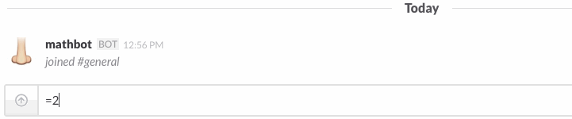

Owenbot
=============

A message from Owen Alea:

"Hello Anarchs of Progress Heights! Answering all of your questions has become like a full-time job, of which I already had one, so I've built a robot to offload some of my work load. Please bring all your inquiries to Owenbot first and only bother me with them if his answers are insufficient. Thanks for your understanding."

## Installation

See [DEPLOYMENT](DEPLOYMENT.md).

## Usage

Invite Owenbot to a channel and let him answer all your stupid questions, like he already does all the time anyway.

### Commands

#### owenbot calculate [expression]

Calculates a basic math expression. See [Dentaku](https://github.com/rubysolo/dentaku) for what's supported.

You can also do math by starting a message with an equal sign.

#### owenbot

Shows Owenbot version and links.

#### owenbot hi

Politely says 'hi' back.

#### owenbot help

Get help.

## Contributing

See [CONTRIBUTING](CONTRIBUTING.md).

## Copyright and License

This project was originally forked from [slack-mathbot](https://github.com/dblock/slack-mathbot), which is copyright (c) 2015, Daniel Doubrovkine, Artsy and [Contributors](CHANGELOG.md).

This project is licensed under the [MIT License](LICENSE.md).
